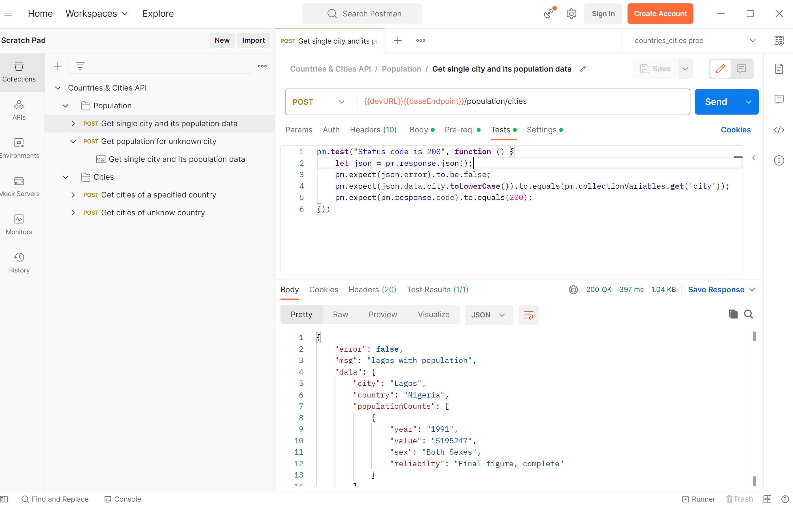

# Postman Scratchpad

## Description

Extract all requests from a postman collection so that they can be edited outside the [Postman UI](https://www.postman.com/) with any IDE.

*A request extracted in YAML format*


*The collection settings extracted in YAML format*


*The same collection opened in Postman UI*


## Roadmap

Hopefully, in the future, we will be able to run the extracted requests with [newman](https://github.com/postmanlabs/newman) and convert them back to a collection file.

## Quick start

First execute npm install to download the dependencies:

```bash
npm install
```

And then you can run the example with:

```bash
npm run clean && npm run build && npm start "./example/in/Countries & Cities API.postman_collection.json" "./example/out/"
```

or even simpler
```bash
./run-example.sh
```