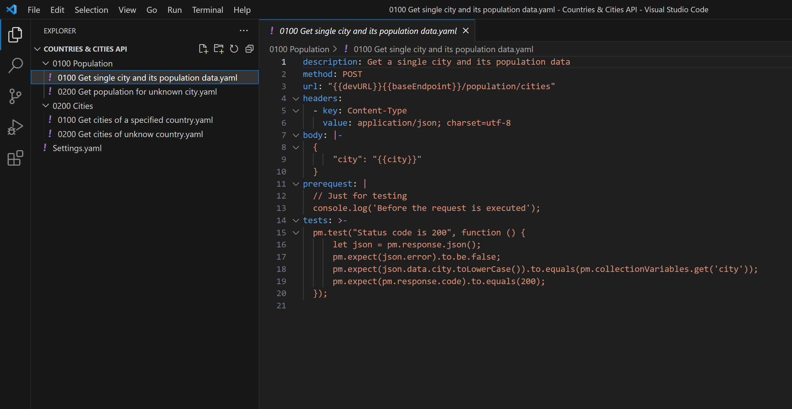

# Postman Scratchpad

## Description

Extract all requests from a postman collection so that they can be edited outside the [Postman UI](https://www.postman.com/) with any IDE.

*A request extracted in YAML format*


*The collection settings extracted in YAML format*


*Request execution preview*


## Roadmap

Hopefully, in the future, we will be able to run the extracted requests with [newman](https://github.com/postmanlabs/newman) and convert them back to a collection file.

## Quick start

First execute npm install to download the dependencies:

```bash
npm install
```

And then you can run the example with:

```bash
./run-example.sh
```

Or the following command to also rebuild the .js file

```bash
./build-and-run-example.sh
```

Finally to extract your own postman collection, you can use the following command:

```bash
 node ./generated/extract-scratchpad.js ~/Postman/collections/my.postman_collection.json ~/Postman/collections/
```
